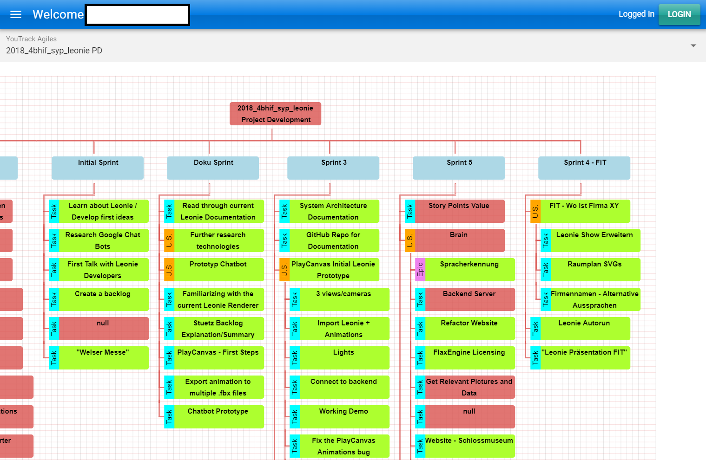

# Youtrack Project Structure Plan Auto-Generation



## [Download](https://github.com/stefnotch/youtrack-diagram/releases)

See [Releases](https://github.com/stefnotch/youtrack-diagram/releases)

## Features

- Sprint Tree View
- Epic Tree View
- Gantt Diagram View
- Export diagrams

## Common Issues

- Firewall: You need to allow this app through the firewall for OAuth 2.0
- Port 25565 in use: This app uses port 25565 for OAuth 2.0

## Used Technologies and Libraries

- [Quasar](https://quasar-framework.org/)
- [Vue.js](https://vuejs.org/)
- [Electron](https://electronjs.org/)
- [youtrack-rest-client](https://github.com/shanehofstetter/youtrack-rest-client)
- [OrgChart](https://github.com/dabeng/OrgChart.js)
- [panzoom](https://github.com/anvaka/panzoom)
- [AppAuth](https://github.com/openid/AppAuth-JS)

## To Install - For Developers

```bash
# Alternatively, you can clone this repo using GitKraken
# Clone this repository
git clone https://github.com/stefnotch/youtrack-diagram
# Go into the repository
cd youtrack-diagram

# Install dependencies
npm install
# Run the app (Development Mode)
npm run dev

# To build it
npm run build

# Go to the built application
cd ./dist/electron
```
